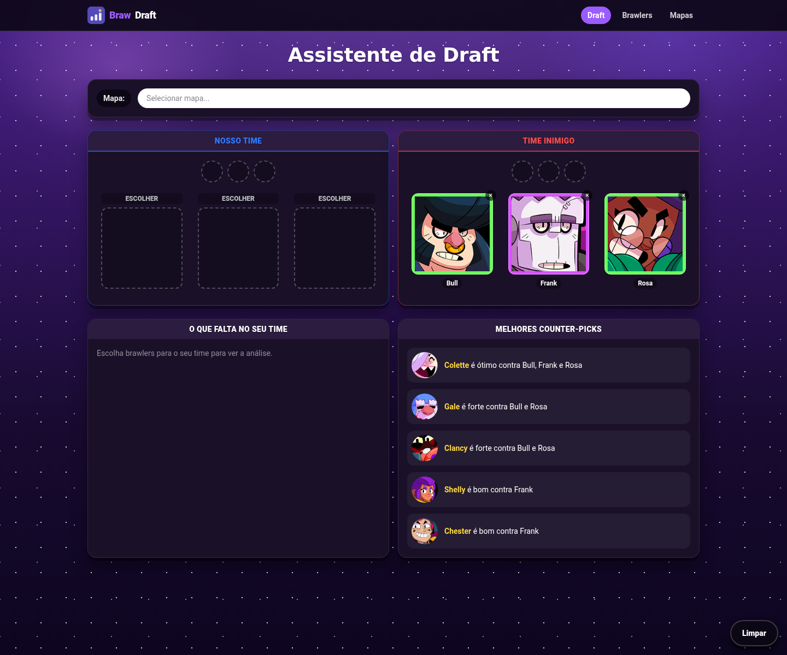
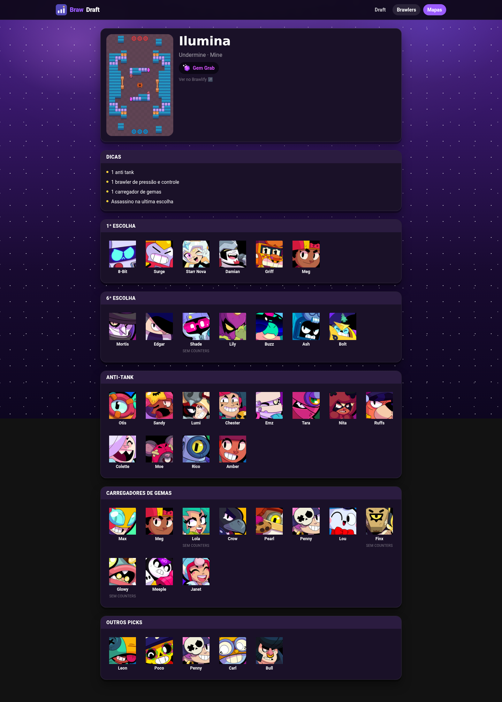

<div align="center">
  

  # BrawDraft

  ### O assistente de draft para Brawl Stars

  [](https://astro.build)
  [](https://www.typescriptlang.org)
  [](https://tailwindcss.com)
  [](https://github.com/RomuloOliveira94/brawdraft/actions/workflows/deploy.yml)

  🔗 **[romulooliveira94.github.io/brawdraft](https://romulooliveira94.github.io/brawdraft/)**
</div>

---

## 🎯 Intenção do app

Num draft de Brawl Stars você tem poucos segundos para decidir cada escolha —
não dá tempo de abrir três guias diferentes para lembrar quem counters quem
ou qual brawler rende no mapa da partida. O BrawDraft existe para resolver
exatamente esse momento: você registra o time inimigo e o mapa, e a página
devolve na hora quem vale a pena escolher e o que ainda falta no seu time.

Não é uma ferramenta de estatísticas nem de meta — é um cola rápida para o
momento do draft, montada a partir de guias que a comunidade já testa em
partida.

## ✨ Funcionalidades

- **Board de draft** com dois times de 3 brawlers cada e ordem de escolha
  livre — qualquer slot, de qualquer time, pode ser preenchido a qualquer
  momento.
- **Seleção de mapa** com sugestões de picks recomendados por categoria
  (1ª escolha, anti-tank, carregador de gemas, etc.) específicas daquele mapa.
- **Banimentos**: cada time tem uma faixa compacta de 3 slots de ban acima
  dos picks, e os brawlers banidos saem da lista de counter-picks sugeridos.
  O recurso é controlado pela constante `SHOW_BANS` em
  [`DraftBoard.astro`](src/components/DraftBoard.astro) — hoje está **ativo**
  (`true`), mas foi desenhado para ser desligado com uma linha caso o produto
  peça de volta a versão sem bans.
- **Sugestões de counter-pick** ranqueadas por cobertura (responder a todos
  os inimigos vale mais que counterar bem só um) e desempate por força do
  counter, sempre excluindo quem já foi escolhido ou banido por qualquer
  time.
- **Análise de composição** ("O que falta no seu time"): aponta ausência de
  tanque, suporte/controle ou alcance longo, alerta times muito agressivos e
  confirma quando a composição está equilibrada.
- **107 páginas de brawlers e 26 páginas de mapas**, geradas estaticamente a
  partir do roster completo.
- **Draft compartilhável pela URL**: mapa, picks e bans de ambos os times
  ficam serializados no hash da página — copiar o link recria o draft.
- **Busca sem distinção de acentos** que também reconhece apelidos em
  PT-BR (digitar "corvo" encontra Crow) — construída sobre uma tabela de
  aliases extraída dos próprios guias curados pela comunidade.

## 📸 Screenshots

<table>
  <tr>
    <td align="center" width="50%">
      
      <br />
      <sub>Board de draft com counter-picks sugeridos</sub>
    </td>
    <td align="center" width="50%">
      
      <br />
      <sub>Detalhe de mapa com picks por categoria</sub>
    </td>
  </tr>
</table>

## 🥊 Stack

- **[Astro 7](https://astro.build)** — geração 100% estática, sem servidor
  em produção.
- **TypeScript em modo `strict`** (`astro/tsconfigs/strict`), inclusive nos
  scripts do pipeline de dados, que rodam via _type-stripping_ nativo do
  Node — sem passo de build separado para eles.
- **Tailwind CSS 4**, via plugin `@tailwindcss/vite`.
- **JavaScript puro no cliente** (`src/scripts/draftBoard.ts`) — nenhum
  framework de UI (React/Vue/Svelte) foi introduzido; é uma escolha
  deliberada para manter o bundle do draft board mínimo.
- **Astro Content Collections** sobre JSON gerado (`src/data/*.json`) em vez
  de consultar uma API em tempo de build ou de request.

## 🚀 Como rodar

Requer **Node 24+** (o pipeline de dados usa _type-stripping_ nativo de
TypeScript do Node, sem transpilação).

```sh
npm install
npm run dev       # servidor de desenvolvimento
npm run build     # build de produção em ./dist/
npm run preview   # pré-visualiza o build de produção
npm run check     # verificação de tipos (astro check)
```

## 📦 Dados

Todo o roster de brawlers, metadados de mapas e as ~139 imagens em
`public/` já vêm **commitados** no repositório — o build de produção roda
inteiramente offline a partir deles, e o CI **nunca** executa o pipeline de
dados (veja `.github/workflows/deploy.yml`).

Para atualizar os dados localmente (novos brawlers/mapas, mudanças na API):

```sh
npm run data:all   # busca, parseia e valida os dados — NÃO roda em CI
```

Esse comando encadeia três passos:

| Script | O que faz |
|---|---|
| `npm run data:brawlers` | Busca o roster e os metadados de mapas na [BrawlAPI](https://brawlapi.com/) (`api.brawlapi.com`) e baixa as imagens da [Brawlify CDN](https://cdn.brawlify.com) (`cdn.brawlify.com`) para `public/`. |
| `npm run data:parse` | Faz o parse dos guias de counter e de mapa, hand-curated em `data/raw/*.txt`, e gera o JSON consumido pelas Content Collections em `src/data/`. |
| `npm run data:verify` | Valida consistência entre roster, mapas e os guias parseados. |

Revise e commite as mudanças em `src/data/*.json` e `public/` normalmente; o
próximo deploy em `main` já sai com os dados atualizados.

## 📁 Estrutura de pastas

```text
/
├── data/raw/               # guias de counter/mapa, hand-curated (.txt), antes do parse
├── docs/                   # screenshots usados neste README
├── public/                 # estáticos servidos como estão: favicons, logo, brawlers/, maps/, game-modes/
├── scripts/                # pipeline de dados (fetch/parse/verify)
├── src/
│   ├── components/         # componentes Astro (DraftBoard, BrawlerPicker, MapPicker, ...)
│   ├── content.config.ts   # definição das Content Collections (brawlers, maps)
│   ├── data/                # JSON gerado pelo pipeline, consumido pelas Content Collections
│   ├── layouts/            # BaseLayout.astro
│   ├── lib/                # utilitários compartilhados (ranking, composição, aliases, base path)
│   ├── pages/              # rotas (/, /brawlers/[slug]/, /mapas/[slug]/)
│   ├── scripts/            # draftBoard.ts — toda a interatividade do draft, em JS/TS puro
│   └── styles/             # CSS global (import do Tailwind)
└── package.json
```

## ☁️ Deploy

Push em `main` dispara o workflow `.github/workflows/deploy.yml`: ele roda
`npm ci && npm run build` e publica `dist/` no GitHub Pages. Também pode ser
disparado manualmente (`workflow_dispatch`) na aba Actions do repositório.

## 🙏 Créditos e aviso legal

- Imagens de brawlers e mapas vêm da **[Brawlify CDN](https://github.com/Brawlify/CDN)**.
  O próprio README da CDN diz que o uso não exige crédito, mas o crédito vai
  aqui mesmo assim.
- Metadados de roster e mapas vêm da **[BrawlAPI](https://brawlapi.com/)**.
- As sugestões de counter-pick e de picks por mapa são **dados
  curados pela comunidade/usuário** (`data/raw/`), não informações oficiais
  da Supercell — trate-as como um guia informal, não como referência
  definitiva.
- Brawl Stars é uma propriedade da Supercell. Este é um projeto de fã
  não-oficial, sem qualquer afiliação com ou endosso da Supercell — veja a
  [Fan Content Policy](https://supercell.com/en/fan-content-policy/) da
  Supercell.
